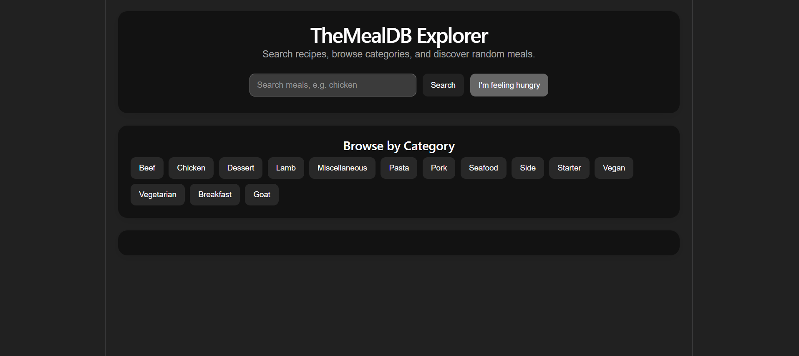
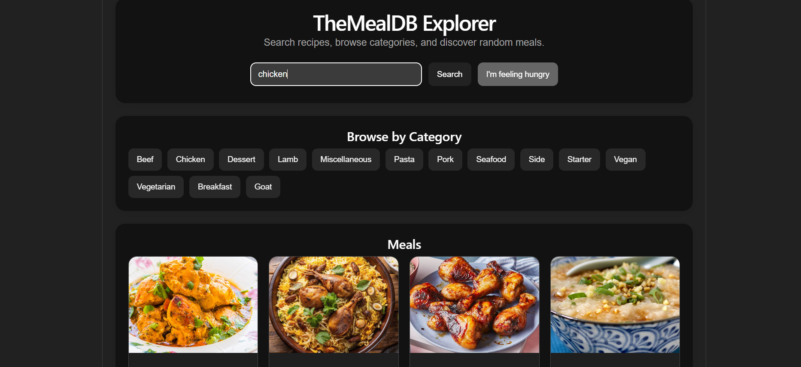
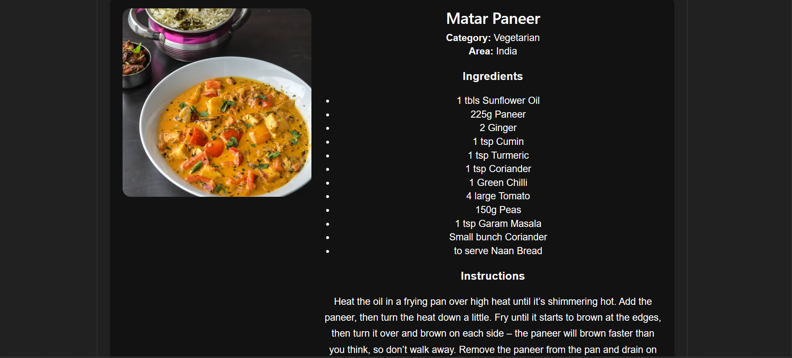

# TheMealDB Explorer

TheMealDB Explorer is a full-stack recipe discovery application built as part of Assignment.

The application allows users to search meals by name, browse meals by category, view random meal suggestions, and see complete recipe details including ingredients, instructions, and YouTube video tutorials.

## Tech Stack

### Backend
- Java 21
- Spring Boot
- Maven
- Spring Web
- Spring Cache
- Caffeine Cache
- RestClient

### Frontend
- React
- Vite
- JavaScript
- HTML
- CSS

### External API
- TheMealDB Public API  
  https://www.themealdb.com/api.php

## Features

- Search meals by name
- Browse meals by category
- View random meal suggestions
- View detailed recipe information
- Display ingredients and measurements
- Display cooking instructions
- Embed YouTube recipe video
- Responsive UI for desktop
- Backend caching with expiry and max size
- Global exception handling

## Project Structure

```text
themealdb-explorer
├── backend
│   ├── src
│   ├── pom.xml
│   └── mvnw / mvnw.cmd
├── frontend
│   ├── src
│   ├── package.json
│   └── vite.config.js
└── README.md
```

## Backend API Endpoints

Base URL:

```text
http://localhost:8080/api
```

| Method | Endpoint | Description |
|---|---|---|
| GET | `/categories` | Fetch all meal categories |
| GET | `/meals/search?name=chicken` | Search meals by name |
| GET | `/meals/category/{category}` | Fetch meals by category |
| GET | `/meals/random` | Fetch a random meal |
| GET | `/meals/{id}` | Fetch meal details by meal ID |

## TheMealDB API Mapping

| Application API | TheMealDB API |
|---|---|
| `/api/categories` | `/categories.php` |
| `/api/meals/search?name=chicken` | `/search.php?s=chicken` |
| `/api/meals/category/Chicken` | `/filter.php?c=Chicken` |
| `/api/meals/random` | `/random.php` |
| `/api/meals/52772` | `/lookup.php?i=52772` |

## Cache Strategy

The backend uses Caffeine in-memory caching.

Cache configuration:

```text
Maximum size: 100 entries
Expiry: 10 minutes after write
```

Cached APIs:

- Categories
- Meal search
- Meals by category
- Meal details by ID

The random meal endpoint is intentionally not cached because users expect a new random result when clicking the random meal button.

## How to Run Locally

### Prerequisites

Make sure the following are installed:

- Java 21
- Maven
- Node.js
- npm
- Git

### Run Backend

Open terminal in the backend folder:

```bash
cd backend
mvn spring-boot:run
```

Backend will run on:

```text
http://localhost:8080
```

### Run Frontend

Open another terminal in the frontend folder:

```bash
cd frontend
npm install
npm run dev
```

Frontend will run on:

```text
http://localhost:5173
```

## Screenshots

### Home Page



### Meal Search



### Recipe Details




## Author

Yadavalli Sai Varun